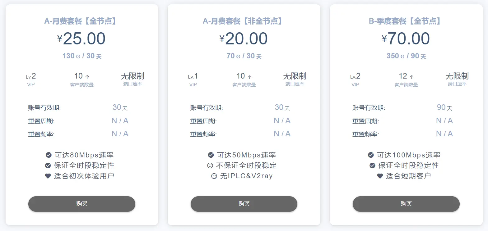

:::caution
以下内容仅作为日常的工作和学习使用，例如：利用Github进行代码开发、浏览国外一些技术文章、观看教学视频等。请勿用此参与不法行为。
:::

这是一家长期走中高端路线的 ShadowsocksR / V2ray 机场，已经稳定运行2年之久。

与其他平台对比下来，这家的性价比是相当高的，提供的流量也十分的充足。用了很久，我的日常是上Youtube、Github、在Google查资料以及访问一些其他的网站，体验是不错的，我一般把他挂在路由器当透明代理来用，为网络下的所有设备提供畅通无阻的体验。

<!-- truncate -->

简单介绍一下，想要详细了解的可以[注册体验](https://t.ohmy.cat/ee)。

- 采用封闭邀请，精选客户，稳定可靠安全
- 定期发放折扣，部分套餐低至9.5元/月，具有极高性价比（可提供企业定制服务）
- 全面解锁 Netflix,DMM,HULU,TVB 等各类流媒体，YouTube4K-8K无压力
- 支持 Windows/Mac/iOS/Android/软路由，支持多设备同时使用
- 充值采用支付宝，支付安全便捷，使用教程简单易用
- 和多家IDC深入合作，如阿里云，GmoCloud，香港宽频，中华电信……
- 全球线路全面，香港（HK,HKBN,CN2）、日本(IIJ，NTT)，台湾（HiNet，TFN）、新加坡、美国（GIA,NCP）、韩国(AWS)、俄罗斯(KHV)、英国(NTT)、澳门(CTM)以及回国中转BGP等线路可选
- 提供昂贵的IPLC线路，在网络环境好的情况下，可为游戏加速

个人推荐 ￥115 的年费套餐，一年512G流量，很难用完，多人合买的话更香。

完整地址：https://t.ohmy.cat/ee

